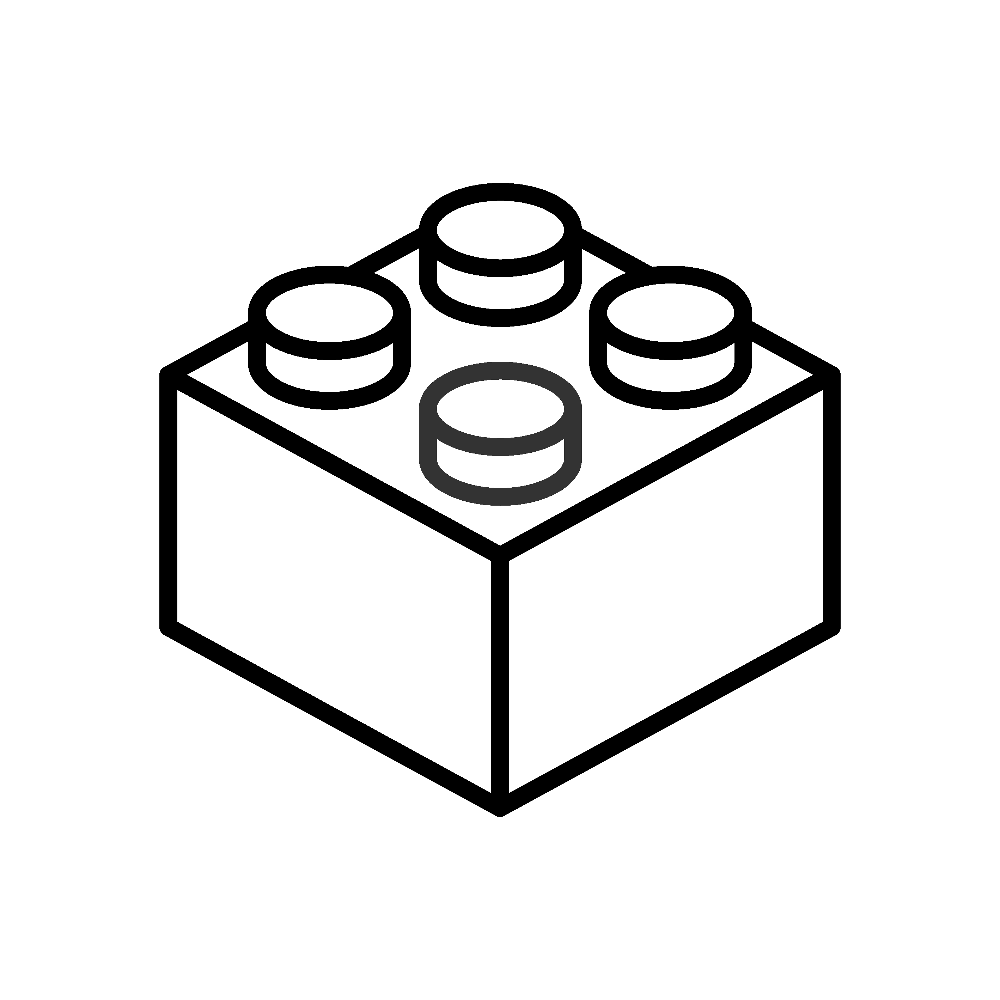
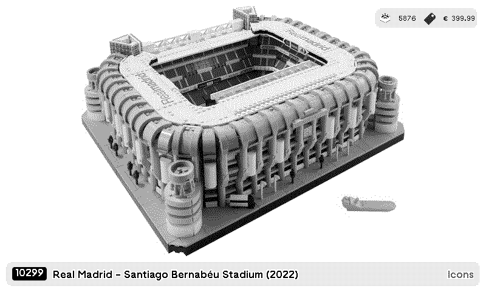

# tmrnl-lego-sets-plugin

<!-- PLUGIN_STATS_START -->
## 🚀 TRMNL Plugin(s)

*Last updated: 2026-06-22 11:35:42 UTC*

##  [Lego Sets](https://usetrmnl.com/recipes/184371)

### Description
Display LEGO® sets on your TRMNL device with powerful filtering options using community APIs.  <strong>Data Sources:</strong> ● <strong>Rebrickable Mode (Default):</strong> Uses curated dataset from <a href='https://rebrickable.com/'>Rebrickable.com</a> with theme and part count filters ● <strong>BrickSet Mode:</strong> Uses live API from <a href='https://brickset.com/'>BrickSet.com</a> with personal collection features (owned/wanted), minifigure counts, and regional pricing  <strong>BrickSet Setup (Optional):</strong> 1. Create a free account at <a href='https://brickset.com/signup'>brickset.com/signup</a> 2. Request your API key at <a href='https://brickset.com/tools/webservices/requestkey'>brickset.com/tools/webservices/requestkey</a> 3. Enter your API key in the field below to enable BrickSet mode 4. (Optional) For owned/wanted filtering: obtain your userHash via the <a href='https://brickset.com/article/52664/api-version-3-documentation'>BrickSet login API</a>  <strong>Important Notes:</strong> ● When using BrickSet mode, you must select at least one theme OR set a min/max year filter OR owned/wanted filter ● Filter options automatically adjust based on your selected data source

### 📊 Statistics

| Metric | Value |
|--------|-------|
| Installs | 1 |
| Forks | 31 |

---

<!-- PLUGIN_STATS_END -->